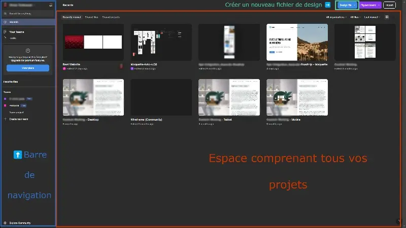

# Qu'est ce que Figma ?

## Présentation de l'outil

Figma est un **outil de maquettage et prototypage collaboratif** permettant de travailler sur un projet web côté design. Créé en 2012 et rendu public en 2016, ce logiciel s'est imposé comme l'**un des plus utilisés au monde dans son domaine** pour sa simplicité, sa gratuité (freemium), son aspect collaboratif et une communauté qui enrichit d'ajouts utiles comme des templates et des plugins.

Aujourd'hui leader d'un marché composé de plusieurs concurrents, Figma a même failli être racheté par Adobe (PhotoShop, Illustrator, ...) qui a dû renoncer au dernier moment (voir la [section "Ressources Utiles"](#ressources-utiles) en bas de page).

## Accès à l'outil

La première chose qu'il faut faire pour travailler sur Figma est tout simplement de te rendre sur le site Internet et de te créer un compte afin d'accéder à l'interface de l'outil.

> 😉 Sens-toi libre de créer un compte depuis l'adresse mail de ton choix.

## Interface d'accueil

:information_source: Les captures d'écran de cet atelier ont été faites avec le thème sombre. A vous de voir si vous souhaitez utiliser ce thème ou non. Selon la page où vous êtes cette option se trouve, soit au niveau de ton *Nom d'utilisateur > Theme*, soit sur l'*icône Figma > Preferences > Theme*.

À l'arrivée sur l'outil, tu vas être directement au contact de tes fichiers créés (jusqu'ici, il n'y en a aucun, mais ça va venir 😉).

Pour créer un nouveau fichier, il te suffit de cliquer sur le bouton "Design file", de choisir l'équipe dans laquelle sera enregistré ce fichier (Ici, celle avec ton nom => ex : `MyName / Team Project`) et te voilà prêt à attaquer ton projet. 💪

    

---

## Ressources utiles

- 📄["Adobe doit renoncer à l'acquisition de Figma" - Source : blogdumoderateur.com](https://www.blogdumoderateur.com/adobe-renoncer-acquisition-figma/)
- 📄["Figma, challenger devenu numéro 1 - Source : hubvisory.com](https://www.hubvisory.com/fr/blog/figma-challenger-devenu-numero-ndeg1-comment-ont-ils-fait)
- Liste non-exhaustive d'outils similaires :
  - [PenPot](https://penpot.app/)
  - [Sketch](https://www.sketch.com/)
  - [ProtoPie](https://www.protopie.io/)
  - [MockPlus](https://www.mockplus.com/)
  - ...

---

[◀️ Le Webdesign](./01-webdesign.md)

[Figma - l'interface ▶️](./03-figma-interface.md)

[Retour à l'accueil 📍](../README.md)
