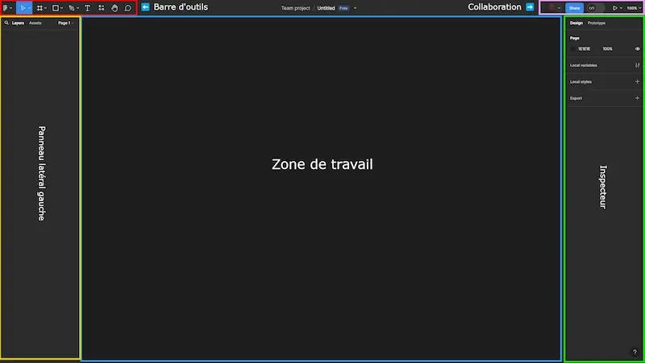

# Interface de travail

Tu l'auras remarqué, il y a plusieurs espaces sur Figma, et plein de choses un peu partout 👀. Faisons le tour du propriétaire 🚶:

- **Barre d’outils** 🟥 : En haut à gauche, c'est ici que tu trouveras tes outils pour parfaire ton design 🛠️✨.

- **Zone de travail** 🟦 : Au centre, c'est là que la magie va opérer 🎩🐰. Imagine qu'il s'agit d'une grande table sur laquelle tu vas venir poser les différentes maquettes.

- **Panneau latéral gauche** 🟨 : À gauche... Ce panneau te permet d'accéder rapidement à tes projets, naviguer entre tes calques et pouvoir les organiser comme tu le souhaites 📂🔍.

- **Inspecteur (panneau latéral droit)** 🟩: À droite... Ce panneau te permet d'ajuster tous les détails de ton design, des couleurs à la typographie, en passant par les espacements. En gros, c'est ton centre de contrôle pour peaufiner chaque élément à la perfection 🎚️🌈

- **Collaboration en temps réel** 🟪 : En haut à droite. Tu pourras rajouter des personnes à ton projet facilement grâce au bouton "share" par exemple. Ou bien voir le rendu avec le bouton "play" 🎥👥.

    

---

[◀️ Figma - introduction](./02-figma-intro.md)

[Figma - Projet fil rouge ▶️](./04-figma-fil-rouge.md)

[Retour à l'accueil 📍](../README.md)
