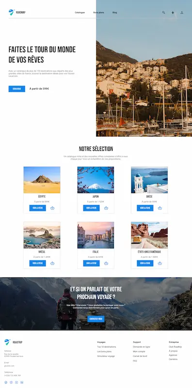

# Projet fil rouge

## Roadmap : votre projet voyage 🌍

Dès à présent, et ce jusqu'à la fin de ce cours interactif, nous allons apprendre en faisant (ou faire en apprenant ). 🥳🎉👯‍♂️ Et sans plus tarder, voici ce que l'on va créer :

    

## Analyse

Normalement, tu n'as pas une maquette toute faite à reproduire au départ, ça n'aurait pas de sens 😅. Toutefois, partons du principe que comme tout créatif, tu t'es inspiré de sites existants sur la thématique et qu'une recherche a été faite.

### Travail en amont

Notre designer a réalisé plusieurs étapes avant de faire sa maquette, en voici les principales :

- 🔍 **Faire une veille** sur des sites comme [Dribble](https://dribbble.com/) ou [LandingFolio](https://www.landingfolio.com/) pour trouver des mises en page de boutiques, sobres et assez classieuses.
- 🅰️🅱️ **Chercher un couple de police de caractères qui fonctionnent bien entre elles**. [Fontpair](https://www.fontpair.co/all) est sympa pour ça car il permet de coupler deux polices (une pour les titres, une autre pour les textes) afin de trouver un style qui correspond au thème de ton site.
- 🎨 Même chose pour les **couleurs**, il faut qu'**elles soient complémentaires**. Un outil comme [Adobe Color](https://color.adobe.com/fr/explore) permet de trouver rapidement des couleurs qui fonctionnent entre elles via des mots-clés.

### S'inspirer pour créer

Il est très important de garder en tête que personne n'est touchée par la grâce de la créativité en inventant quelque chose de nouveau de par sa simple volonté, bouleversant les codes établis. ⚡🧠

En vrai, si tu analyses avec attention, **on ne fait que s'inspirer des uns des autres**; c'est normal et c'est valable pour tout :

- Lorsque tu développes, tu te bases sur de la documentation, des extraits de code réalisés par d'autres développeurs ayant eu les mêmes problèmes que toi que tu vas adapter à ton propre projet, et c'est exactement ce qu'il faut faire. 👍

- Lorsque tu fais un travail créatif, c'est la même chose, **tu t'inspires de l'existant**, **de ce que tu aimes**, qui te semble cohérent. **La plus grande erreur est donc de ne pas faire une veille** ou de refuser de regarder ce qui se fait actuellement.

    

> _Est-ce que s'inspirer c'est copier ? 🤔_
>
> On te voit venir avec ta question existentielle ! Hé bien, c'est un débat long mais que l'on va résumer ici :
>
> - **S'inspirer** part du principe que tu picores des idées à droite à gauche, que tu vas mixer avec tes propres envies et paramètres que tu souhaites ajouter ou retirer, s'éloignant d'un élément précis. ✅
> - À l'inverse, **copier** reviendrait à reprendre bêtement un élément et à le transposer sans aucun effort d'adaptation ou très grossier ne masquant pas la supercherie. ❌

**Tu as beaucoup de sites et de ressources existantes pour t'inspirer** et aller secouer l'artiste qui sommeille en toi. Il existe dans ce cours une liste non-exhaustive d'outils et de références qui t'aideront à réaliser des maquettes de sites très sympas. [Va y jeter un oeil](../ressources.md) 👀

**N'hésites pas non plus à analyser les sites que tu consultes**, à comprendre leur fonctionnement, ce qui fait leur force et leur faiblesse. Ce travail en tâche de fond te sera bénéfique au long terme. #CultureGénérale 😎

---

[◀️ Figma - Interface](./03-figma-interface.md)

[Figma - Frames ▶️](./05-figma-frames.md)

[Retour à l'accueil 📍](../README.md)
