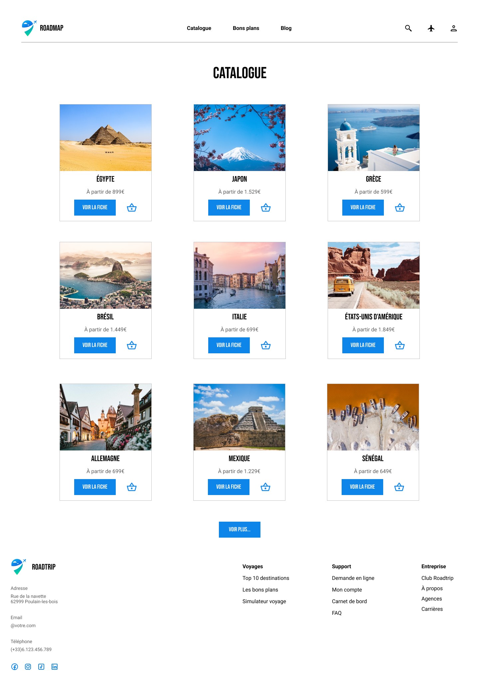

# Projet fil rouge

## Roadmap : votre projet voyage 🌍

Dès à présent, et ce jusqu'à la fin de ce cours interactif, nous allons apprendre en faisant. 🥳🎉👯‍♂️ Et sans plus tarder, voici ce que l'on va créer :

### Page d'accueil

    

### Page catalogue

    

## Analyse

Normalement, vous n'avez pas déjà une maquette toute faite à reproduire, ça n'aurait pas de sens 😅. Toutefois, partons du principe que comme tout créatif, vous vous êtes inspirés de sites existants sur la thématique et qu'une recherche a été faite.

### Travail en amont

Notre designer a réalisé plusieurs étapes avant de faire sa maquette, en voici les principales :

- 🔍 **Faire une veille** sur des sites comme [Dribble](https://dribbble.com/) ou [LandingFolio](https://www.landingfolio.com/) pour trouver des mises en page de boutiques, sobres et assez classieuses.
- 🅰️🅱️ **Chercher un couple de police de caractères qui fonctionnent bien entre elles**. [Fontpair](https://www.fontpair.co/all) est sympa pour ça car il va vous choir une font pour les titres et une autre pour les textes, en vous montrant des exemples.
- 🎨 Même chose pour les **couleurs**, il faut qu'**elles soient complémentaires**. Un outil comme [Adobe Color](https://color.adobe.com/fr/explore) permet de trouver rapidement des couleurs qui fonctionnent entre elles via des mots-clés.

### S'inspirer pour créer

Il est très important de garder en tête que personne n'est touchée par la grâce de la créativité et invente quelque chose de nouveau de par sa simple volonté, boulversant les codes établis. ⚡🧠

En vrai, si vous scrutez bien, **on ne fait que s'inspirer des uns des autres**; c'est normal et c'est valable pour tout :

- Lorsque vous développez, vous vous basez sur la documentation, Stack Overflow, des exemples trouvés en ligne...
- Lorsque vous faites un travail créatif, c'est la même chose, **vous vous inspirez de l'existant**, **de ce que vous aimez**, qui vous semble cohérent. **La plus grande erreur est donc de ne pas faire une veille** ou de refuser de regarder ce qui se fait actuellement.

    

> **Est-ce que s'inspirer c'est copier ? 🤔**
>
> On vous voit venir avec votre question existentielle ! Hé bien, c'est un débat long mais que l'on va résumer ici :
>
> - **S'inspirer** part du principe que vous picorez des idées à droite à gauche, que vous allez mixer avec vos propres envies et paramètres que vous souhaitez ajouter ou retirer, s'éloignant d'un élément précis. ✅
> - À l'inverse, **copier** reviendrait à reprendre bêtement un élément et à le transposer sans aucun effort d'adaptation ou très grossier ne masquant pas la supercherie. ❌

**Vous avez beaucoup de sites, de ressources existantes pour vous inspirer** et aller secouer l'artiste qui sommeille en vous. Il existe dans ce cours une liste non-exhaustive d'outils et de références qui vous aideront à réaliser des maquettes de sites très sympas. [Allez y jeter un oeil](../ressources.md) 👀

N'hésitez pas non plus à analyser les sites que vous consulter, à comprendre leur fonctionnement, ce qui fait leur force et leur faiblesse. Ce travail en tâche de fond vous sera bénéfique au long terme. #CultureGénérale 😎

---

[◀️ Figma - Interface](./03-figma-interface.md)

[Figma - les frames ▶️](./05-figma-frames.md)

[Retour à l'accueil 📍](../README.md)
