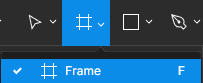
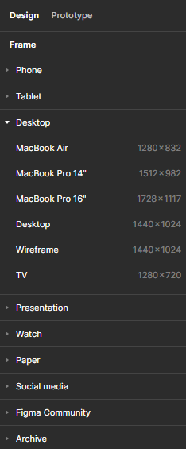
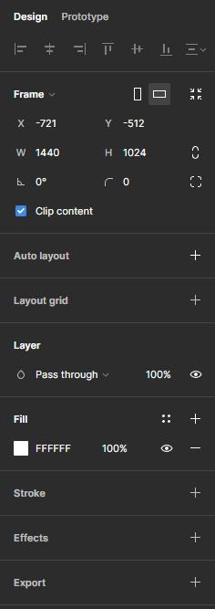
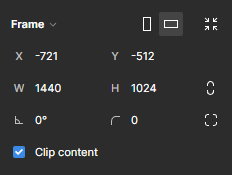
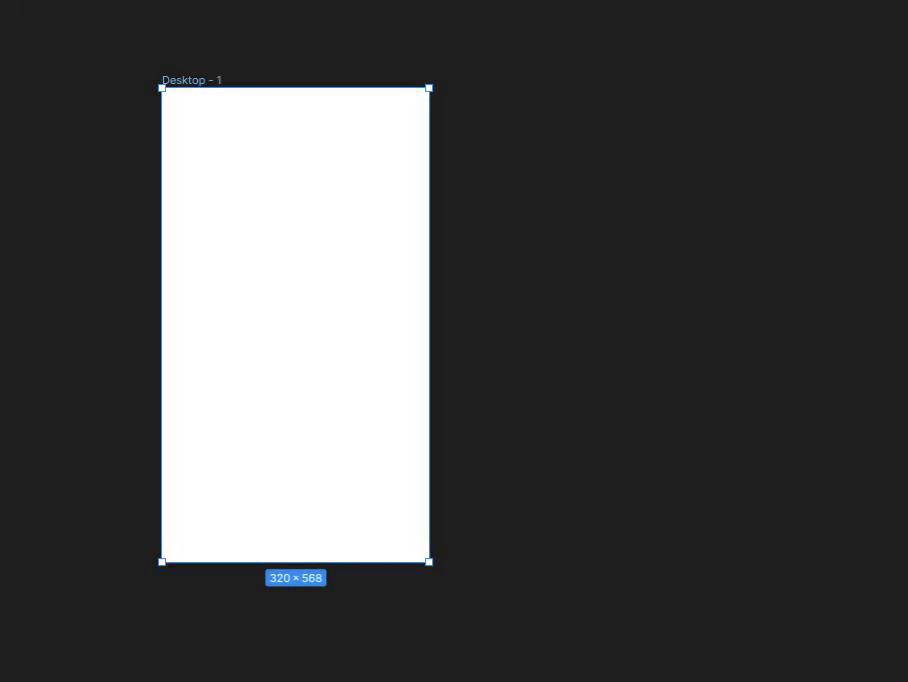
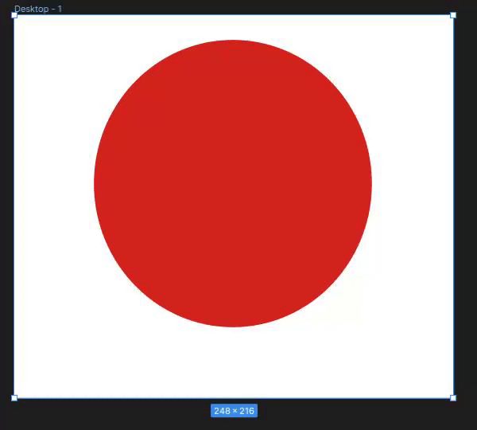
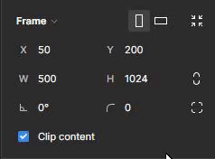

# Les Frames

_(pzzt 😜, n’hésite pas à pratiquer en même temps)_

## C'est quoi une frame ?

Une frame ("cadre" en `fr`) dans Figma joue un rôle crucial dans la structuration et l'organisation de tes designs. Chaque maquette, wireframe représentant une page de ton site sera basé sur une frame. 🖼️

En somme, c'est une sorte de conteneur qui va comprendre le design d'une page de la dimension de ton choix. 🔲

Mais là où c'est encore plus génial, c'est que Figma te propose une large liste de frames proposées. Voyons ça d'un peu plus près... 🔍

> ⚠️ Attention à ne pas confondre une frame et les formes disponibles plus basiques comme le carré, le rond ou le triangle. Ces dernières sont utilisées pour créer des éléments de notre deisgn qui seront contenues dans une frame. Voyez une frame comme une boîte et non pas comme un élément de design à part entière.

---

## Comment utiliser les Frames ?

### Création d'une première frame

Rends-toi sur la barre d'outils et sélectionne l'outil Frame (raccourci clavier `F`) :

<figure align="center">
    
    <figcaption>La barre d'outils</figcaption>
</figure>

Après avoir sélectionné l'outil de création de frames dans Figma, tu remarqueras l'apparition, sur la partie droite de ton écran 💻➡️, d'une variété de templates prédéfinis. Ces templates sont disponibles en différentes tailles, adaptées aux supports les plus couramment utilisés aujourd'hui : mobiles, tablettes, et écrans d'ordinateur. Idéal pour gagner un temps fou ! 😎

<figure align="center">
    
    <figcaption>Liste des templates de frames</figcaption>
</figure>

Tu as donc désormais le choix pour créer une frame :

1. Soit créer une frame main-libre de la taille de ton choix via la souris en dessinant un cadre;
2. Soit sélectionner une frame prédéfinie via les templates proposées par l'outil.

### Option d'une frame

Choisis une frame disponible dans les templates de ton choix. Dès lors que tu sélectionnes la frame dans laquelle tu souhaites travailler, l'inspecteur (à droite de l'écran) affiche un nouveau menu rempli d'options :

<figure align="center">
    
    <figcaption>Menu d'options d'une frame</figcaption>
</figure>

Faisons le tour des options afin de manipuler au mieux nos frames. 🕹️

### Positionnement et options de base d'une Frame

Attaquons-nous tout d'abord aux options de positionnement et de dimensions de notre frame :

<figure align="center">
    
    <figcaption>Options de poistionnement et de dimensions</figcaption>
</figure>

- Tout d'abord, si vous cliquez sur l'option `Frame 🔽`, vous allez pouvoir redimensionner votre cadre de travail selon les templates prédéfinis sur Figma ! Utile, si vous souhaitez changer rapidement sans avoir à tout recommencer.
- A droite de `Frame 🔽`, vous avez un rectangle **vertical** et un rectangle **horizontal** : il s'agit ici d'une option pour faire une rotation de votre frame. Essayez de cliquez dessus, vous verrez que votre frame se tourne automatiquement en fonction de l'option choisie (de base horizontalement ↔️). C'est très pratique si vous souhaitez partir d'un template d'un écran qui devra être présenté en fonction de l'usage de l'utilisateur comme pour l'écran d'un smartphone 📱.

    

- La dernière option de cette ligne se nomme "Resize to fit" ("redimensionner pour s'adapter"). Ce n'est pas une option très utilisée dans le cadre d'une frame qui représenterait une page web mais si vous créez des frames à main levée qui contiennnent différents éléments et dont vous souhaitez enlever les marges intérieures (padding, ça vous dit quelque chose ? 😏), vous pouvez cliquer sur "Resize to fit" pour avoir redimensionnement automatique de votre frame selon ce qu'elle contient.

    

#### Positionnement 📍

Comme lorsque vous faites du CSS (j'en vois certains en sueurs 😰), chaque élément a une position selon l'endroit (le parent) dans lequel il est situé. Pour une frame ou une forme créée (carré, rond, ...), vous pouvez indiquez la position initiale de celle-ci.

_Mais si une frame représente une de nos maquettes, par qui est-elle contenue ?_ 🤔

Hé bien, chaque frame est contenue dans notre espace de travail. L'espace de travail est un peu le `<body>` de notre projet dans lequel nous allons mettre toutes nos frames. 👌

Ici, nous pouvons donc choisir la position de notre élément. Pour être plus précis, de base nous allons indiquer où va débuter notre frame et pour cela il faut savoir définir le point d'ancrage ⚓.

De base, elle se situe en haut à gauche et le sera obligatoirement pour nos frames (ce ne sera pas le cas de nos éléments créés dont on pourra choisir le point d'ancre).

Les options pour positionner sont définies par deux axes (retour au collège 😰) :

- L'axe horizontal (X) ↔️
- L'axe vertical (Y) ↕️

#### Dimensions 📐

Si un objet a une position, il a aussi une dimension 🐘. Et elles vous sont familières ces deux options car vous avez dû les utiliser en CSS :

- `W` pour `width` (largeur) : cette option définit la largeur de notre frame ou notre objet.
- `H` pour `height` (hauteur) : cette option définit la hauteur de notre frame ou notre objet.

> 📏 L'unité de chacune de ces options est en `px` (pixel).

Vous pouvez très bien changer ces options librement, vous pouvez même faire un calcul dans ces zones. Imaginons que je souhaite que ma frame soit d'une largeur de 4 fois 375px (`4 * 375`), il me suffit d'entrer cette opération dans mon champ et appuyer sur entrée :

    

> 🧮Addition, soustraction, multiplication, division ! Notre ami Figma vous évitera les prises de tête afin de faire toutes vos opérations à votre place. Quel ami ! 😌

### Utilisation de Clip Content

L'option "Clip Content" dans Figma est un outil puissant pour gérer la visibilité des éléments à l'intérieur de tes frames. Lorsqu'elle est activée, cette fonctionnalité assure que tout contenu dépassant les limites de la frame soit masqué, c'est-à-dire que tout élément situé à l'extérieur du cadre de la frame ne sera pas visible dans ton design final.

- **Activé** : Si tu choisis d'activer "Clip Content", tu définis une limite stricte pour ta frame. Cela signifie que si tu places un élément partiellement ou totalement en dehors des limites de cette frame, les parties qui débordent seront automatiquement cachées. Cette option est particulièrement utile pour créer des designs épurés et pour s'assurer que les éléments ne sortent pas de leurs conteneurs prévus.
- **Désactivé** : Lorsque "Clip Content" est désactivé, les éléments placés à l'intérieur de la frame peuvent déborder sans être coupés. Cela peut être utile lors de la phase de conception et d'expérimentation, où tu souhaites voir comment différents éléments interagissent au-delà des limites strictes de leurs frames.

**Exemples :**

    

### Options de calques // Layer

Cette options va te permettre d’ajuster l’opacité de ta frame. Il y a d’autres options mais on ne va trop rentrer dans les détails. Tu retrouveras cela dans la section `Layer`

**Exemples :**

    

### Modification de la couleur

Tout comme avec les options de calques, nous allons garder les choses simples pour changer la couleur d'un élément. Voici comment faire :

- **Accède à la Section "Fill"** : Dirige-toi vers la partie droite de l'interface, dans l'inspecteur, et cherche la section intitulée "Fill".
- **Sélectionne la Couleur** : Clique sur le carré de couleur pour ouvrir la palette de couleurs. Là, tu auras la liberté de choisir précisément la teinte que tu désires pour ton élément.
- **Ajustements et Transparence** : Non seulement tu peux choisir n'importe quelle couleur, mais tu as aussi la possibilité d'ajuster sa transparence en jouant avec l'opacité.
- **Rendre l'Élément Visible ou Invisible** : À côté de la section "Fill", tu trouveras une icône en forme d'œil. En cliquant dessus, tu peux choisir de rendre cet élément visible ou non. C'est un excellent moyen de comparer ton design avec ou sans cet élément spécifique.

**Exemple :**

    

