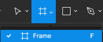
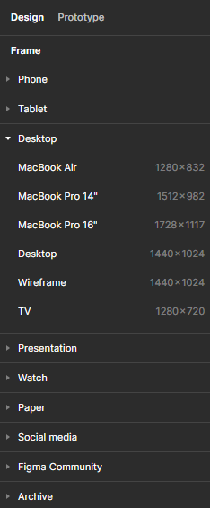
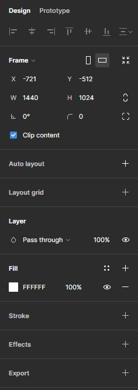
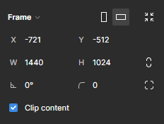
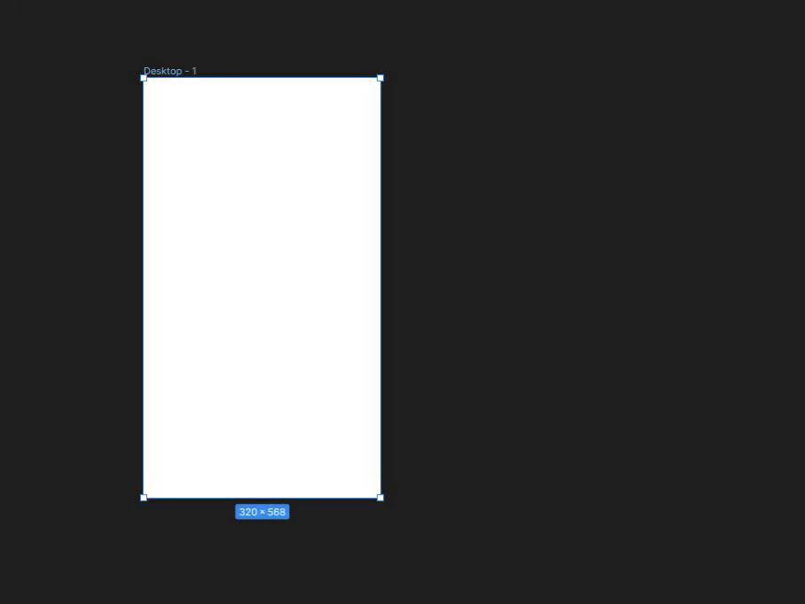
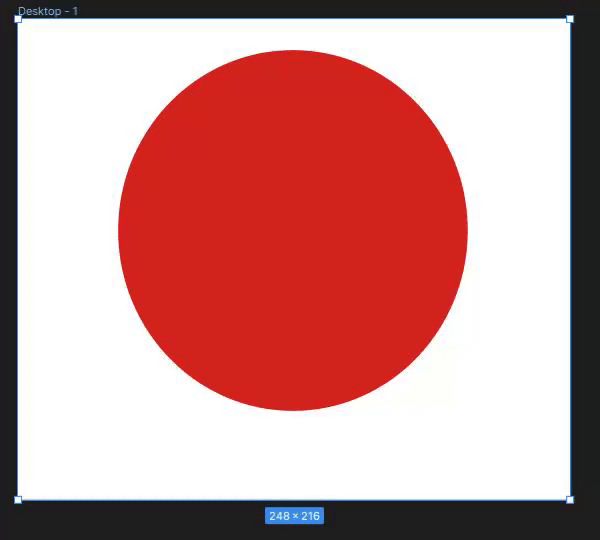
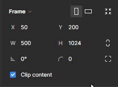

# Les frames

## C'est quoi la différence entre une frame et une forme

Pour créer notre design sur Figma, nous allons différencier deux éléments de base :

- **Frame** : la frame est un cadre de travail où tu vas déposer différents éléments, formes, ... composant ta maquette. C'est ta feuille de papier ! 📜
- **Forme** : Les formes sur Figma sont des éléments de base qui vont te servir à créer les éléments composant ta maquette. Rectangle, rond, triangle... Tout part d'une forme simple que l'on adapte, module à notre envie. 👩‍🎨

---

## Création d'une première frame

Débutons notre travail de recréation de la maquette en créant une frame pour la page d'accueil. 🖼️ Notre maquette est une reproduction d'un écran d'ordinateur classique 🖥️.

Rends-toi sur la barre d'outils et sélectionne l'outil Frame (raccourci clavier `F`) :

    

Après avoir sélectionné l'outil de création de frames dans Figma, tu remarqueras l'apparition, sur la partie droite de ton écran 💻➡️, d'une variété de templates prédéfinis. Ces templates sont disponibles en différentes tailles, adaptées aux supports les plus couramment utilisés aujourd'hui : mobiles, tablettes, et écrans d'ordinateur. Idéal pour gagner un temps fou ! 😎

    

Tu peux aussi réaliser ta propre frame via ta souris en maintenant le clic-gauche, comme ceci :

    

### Option d'une frame

Analysons les options présentes sur le panneau de droite de l'outil.

    

> 💡 Chaque forme/frame que tu sélectionnes sur Figma a son panneau de configuration. Il s'adapte en fonction du type d'objet que tu manipules. Le panneau d'une frame n'est pas le même que celui d'une forme, d'une police de caractères, ...

### Positionnement et dimensions

Attaquons-nous tout d'abord aux options de positionnement et de dimensions de notre frame :

    

- Tout d'abord, si tu cliques sur l'option `Frame 🔽`, tu vas pouvoir redimensionner ton cadre de travail selon les templates prédéfinis sur Figma ! Utile si tu souhaites changer rapidement sans avoir à tout recommencer.

- A droite de `Frame 🔽`, tu as un rectangle **vertical** et un rectangle **horizontal** : il s'agit ici d'une option pour faire une rotation de ta frame. Essaye de cliquer dessus, tu verras que ta frame se tourne automatiquement en fonction de l'option choisie. Voici un exemple concret : tu vas devoir peut-être penser à créer ton site sur mobile; or, un utilisateur peut très bien utiliser ton site en ayant son écran posé de manière verticale ↕️ ou horizontale ↔️. Ton site n'aura donc pas la même largeur d'espace et le contenu devra sûrement s'adapter à cela. Au moment de créer ta maquette, tu pourras donc avoir deux versions de ton site en fonction de la rotation de l'écran. 🧠🔄️

    

- La dernière option de cette ligne se nomme **"Resize to fit"** ("redimensionner pour s'adapter"). Si tu crées des frames à main levée qui contiennent différents éléments et dont tu souhaites enlever les marges intérieures (_le padding, ça te dit quelque chose ? 😏_), tu peux cliquer sur "Resize to fit" pour avoir un redimensionnement automatique de ta frame selon ce qu'elle contient. Démonstration :

    

#### Positionnement 📍

Comme lorsque tu fais du **CSS**, chaque élément a une position selon l'endroit (le parent) dans lequel il est situé. Pour une frame ou une forme créée (carré, rond, ...), tu peux indiquer la position initiale de celle-ci.

_Mais si une frame représente une de nos maquettes, par qui est-elle contenue ?_ 🤔

Hé bien, chaque frame est contenue dans notre espace de travail. L'espace de travail est un peu le `<body>` de notre projet dans lequel nous allons mettre toutes nos frames. 👌

Ici, nous pouvons donc choisir la position de notre élément. On choisit donc un point d'ancrage afin de pouvoir la situer dans notre zone de travail ⚓. Imagine que le travail de maquettage est à faire pour chacune des pages d'un site, dans des versions spécifiques aux écrans sur lequel le site est consultable. Permettre à nos frames d'être organisé sera la moindre des choses pour s'y retrouver. 😉

De base, **le point d'ancrage se situe en haut à gauche de la frame** obligatoirement (ce ne sera pas le cas de nos éléments créés dont on pourra choisir le point d'ancre; par exemple une forme dans une frame se placera dans l'espace de la frame et non pas au niveau de la zone de travail).

Les options pour positionner sont définies par deux axes (retour au collège 😰) :

- L'axe horizontal (X) ↔️
- L'axe vertical (Y) ↕️

#### Dimensions 📐

Si un objet a une position, il a aussi une dimension 🐘. Et elles te sont familières ces deux options car tu as dû les utiliser en CSS :

- `W` pour `width` (largeur) : cette option définit la largeur de notre frame ou notre objet.
- `H` pour `height` (hauteur) : cette option définit la hauteur de notre frame ou notre objet.

> 📏 L'unité de chacune de ces options est en `px` (pixel).

Tu peux très bien changer ces options librement, tu peux même faire un calcul dans ces zones ➕➖✖️➗. Imaginons que je souhaite que ma frame soit d'une largeur de 4 fois 375px (`4 * 375`), il me suffit d'entrer cette opération dans mon champ et appuyer sur entrée :

    

> 🧮Addition, soustraction, multiplication, division ! Figma t'éviteras les prises de tête afin de faire toutes les opérations matéhmatiques à ta place dans les champs comprenant un nombre. Quel ami ! 😌

Il y a plein d'autres options disponibles mais qui n'ont pas réellement d'intérêt premier lorsque l'on parle d'une frame. Toutefois, nous allons en parler via les formes ! 😃

---

## À ton tour 🖌️

Notre première frame sera celle de l'écran d'accueil au format ordinateur standard :

- Sélectionne l'outil `Frame` puis cherche le template `Desktop`.

- Puis renomme cette frame en faisant un clic-droit sur le nom `Desktop-1` dans le panneau latéral gauche > `Rename` ou en double cliquant sur le nom de la frame situé en haut à gauche de celle-ci. Appelles-la `Homepage`.

Enfin, repositionne-la dans la zone de travail en vérifiant que les coordonnées X et Y soient sur `0`.

---

[◀️ Figma - Projet fil rouge](./04-figma-fil-rouge.md)

[Figma - Formes ▶️](./06-figma-formes.md)

[Retour à l'accueil 📍](../README.md)
