# Les formes

## Créer une forme

Maintenant qu'on a une frame qui peut contenir notre maquette, attaquons-nous au contenu. Démarrons par la création d'une forme.

Dans la barre d'outils, sélectionne `Rectangle` ou appuye sur `R` :

<p align="center">
    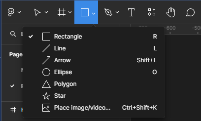
</p>

> 💡Les formes disponibles sont celles qui sont les plus basiques. Elles permettent, si on se projette, de dessiner tout ce que l'on souhaite. Quand on y pense, Batman n'est qu'une superposition de carrés, ronds et de polygones. 🦇

Désormais, il te suffit de cliquer dans la frame de ton choix pour y déposer un rectangle. ⏹️ Si tu ne fais qu'un clic, tu obtiendras un carré de `100px`. Si tu laisses le bouton gauche de ta souris appuyé, tu peux créer un rectangle de la taille de ton choix.

Si l'on regarde notre panneau latéral gauche, on voit que notre rectangle a été ajouté dans notre frame :

<p align="center">
    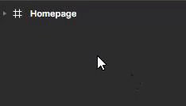
</p>

Le rectangle appartient désormais à notre frame `Homepage` créée à l'étape précédente. 🎉 Il a lui aussi la possibilité d'être positionné et dimensionné.

> ⚠️ Attention ! Notre rectangle est contenu dans notre frame `Homepage`, si on change sa position, le calcul se fera en fonction de l'intérieur de notre frame et non pas de la zone de travail. 📦

Dans l'étape précédente, nous avions fait le choix d'omettre différentes options en parlant des frames. Levons le voile sur de nouvelles possibilités offertes pour nous aider à aller au bout des choses.

## Proportions

Nous avons déjà parlé de la dimension d'un objet; désormais on aimerait t'indiquer une option très pratique t'évitant de contraindre ta forme à garder sa proportion.

Faisons une expérience 🥼🧪 :

Sélectionne le coin en bas à droite d'un rectangle créé et fais en sorte qu'il soit un carré de `300px` précisément 🗜️

<p align="center">
    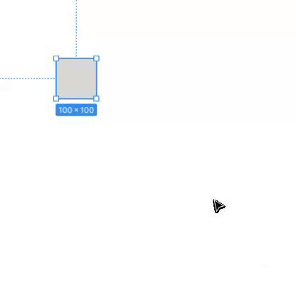
</p>

C'est dur hein ? 😅 Bon, maintenant, imagine que tu aies à faire cela pour chacune des formes qui va composer ta maquette...

<p align="center">
    
</p>

Mais heureusement, tu as déjà les connaissances pour éviter cela ! On peut utiliser les options dans le panneau de droite pour ajouter manuellement les dimensions voulues.

<p align="center">
    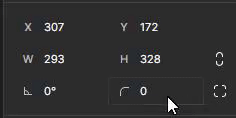
</p>

Youpi ! En deux entrées, notre carré est à la taille souhaitée. 🎉 Mais imaginons que tu souhaites conserver la proportion de ce carré sans savoir la taille qu'il fera. 🥲 Tu vois le symbole "chaînon" 🔗 à la droite de `H` ? Clique dessus et change la hauteur `H` de ta forme à `450px`

<p align="center">
    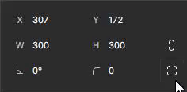
</p>

Tu as vu ? Non seulement on a redimensionné notre carré mais il a gardé ses propotions. C'est idéal si on veut agrandir ou réduire un élément tout en conservant sa propotion initale. 😋

> 💡 Tu peux aussi laisser appuyer la touche `Maj` (Win)/`Cmd` (Mac) et sélectionner le coin de ta forme pour en changer la taille sans que la proportion ne soit affectée. 😉

## Apparence

Jusqu'ici, on sait faire des formes mais on aimerait bien qu'elles soient plus pimpantes, non pas que le gris clair soit dérangeant mais c'est un peu monotone ! 🎨👩‍🎨

Pour cela, je t'invite à aller dans la section `Fill` du panneau d'options (à droite de ton écran ➡️).

<p align="center">
    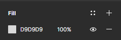
</p>

Lorsque tu cliques sur la case représentant la couleur de la forme, tu vas voir apparaître un nouveau panneau permettant de customiser la couleur de ta forme.

> 💡Les frames ont aussi cette option, très utile si tu veux appliquer une couleur, un dégradé à ta page.

<p align="center">
    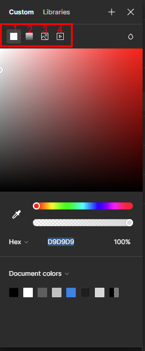
</p>

Tout en haut, nous avons entouré 4 options de remplissage d'une forme :

1. **Couleur unie** : on choisit une seule et même couleur pour toute notre forme.
2. **Dégradé** : On crée un dégradé afin de faire un effet de couleurs mélangées.
3. **Image** : On ajoute une image qui va être incrustée dans notre forme.
4. **Video** : Même chose que pour l'image mais avec une vidéo.

Car une forme peut très bien être d'une couleur ou avoir une image. 🤷‍♀️ Seule ta créativité en décidera. 🧑‍🎨

## Bordures et effets

### Bordures

On peut aussi définir une bordure via l'option `Stroke`. Pour cela, il suffit de cliquer sur le petit `+` afin d'ajouter une bordure à notre forme.

<p align="center">
    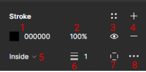
</p>

1. **Couleur** : la couleur de la bordure.
2. **Opacité** : Opacité de la bordure.
3. **Visibilité** : l'oeil te permet d'afficher/masquer la bordure.
4. **Supprimer** : le symbole `-` indique que tu peux supprimer la bordure.
5. **Positionnement** : L'option '5' indique l'endroit où la bordure va s'ajouter via la forme. Tu peux avoir une bordure qui sera plutôt à l'intérieure ou à l'extérieure de la forme.
6. **Épaisseur** : L'épaisseur de la bordure.
7. **Bordure par bord** : Tu ne veux que des bordures sur les côtés de ta forme ? C'est possible via cette option. Tu as juste à sélectionner les bordures de ton choix.
8. **Options supplémentaires** : Si tu veux choisir le motif de la bordure et bien d'autres choses pour pousser encore plus la personnalisation.

### Effets

<p align="center">
    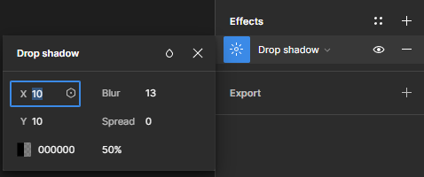
</p>

Le panneau `Effects` te permet d'ajouter des effets à ta forme comme une ombre portée, un effet de flou. Les options présentées ressemblent beaucoup à ce que tu as en CSS.

Faisons la comparaison entre les options présentes sur la capture juste au dessus et l'équivalent en CSS :

```css
.shape {
  box-shadow: 10px 10px 13px 0 rgba(0, 0, 0, 50);
}
```

Hé oui ! Figma utilise les options similaires au CSS afin de faciliter le portage. Fini de faire les choses au doigt mouillé ☝️ grâce à cet outil, tu pourras reprendre exactement les mêmes propriétés dans ton code afin de faire correspondre la maquette et le CSS. 🪄

---

## Groupe de formes

Une autre option très importante à maîtriser dans n'importe quel logiciel de design, graphisme est le **groupement d'objets**.

Jusqu'ici, on a vu que si l'on crée une forme dans notre Frame, celle-ci est automatiquement ajoutée dans l'arborescence que l'on peut consulter sur la colonne de gauche de notre outil. 🪜

Mais il est aussi possible de créer des groupes de formes afin d'indiquer que celles-ci sont parentes ou liées entre elles. Pour créer un groupe, rien de plus simple :

- Sélectionne les formes nécessaires dans l'arborescence située dans le panneau de gauche puis fais un clic-droit et sélectionne l'option `Group Selection`

- Pour dégrouper une sélection d'objets, sélectionne le groupe dans l'arborescence, fais un clic-droit et sélectionne l'option `Ungroup`.

Voici les raccourcis clavier correspondant ⌨️ :
| Commande | Windows | Mac |
| --------- | -------------- | ------------- |
| Grouper | Ctrl + G | ⌘ + G |
| Dégrouper | Ctrl + Maj + G | ⇧ + ⌘ + G |

<p align="center">
    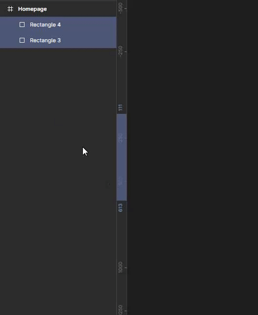
</p>

---

## À ton tour 🖌️

Nous allons créer deux nouvelles formes rectangulaires qui seront le background de la première section de notre page d'accueil.

> ⚠️ La frame `Homepage` ne doit rien contenir. Si tu as pratiqué en créant des formes, c'est bien ! Mais supprime-les afin de pouvoir poser les premières briques de notre maquette. 🙏

Voici quelques éléments à prendre en compte pour les réaliser :

- Les deux rectangles prennent toute la hauteur de base de notre frame `Desktop` soit `1024px`
- Chaque rectangle a une largeur égale à la moitié de la largeur de la frame soit `1440px / 2`
- Le rectangle de gauche sera de couleur blanche dont voici le code hexadécimal : `#FFFFFF`
- Le rectangle de droite sera rempli par une image disponible dans le dossier `exercice/images/header.jpg`
- Créer un groupe avec les deux rectangles réunis. Nommez-le `Hero`
- Renommer le rectangle de gauche `Background-left` et le rectangle de droite `Background-right`

### Résultat attendu

<p align="center">
    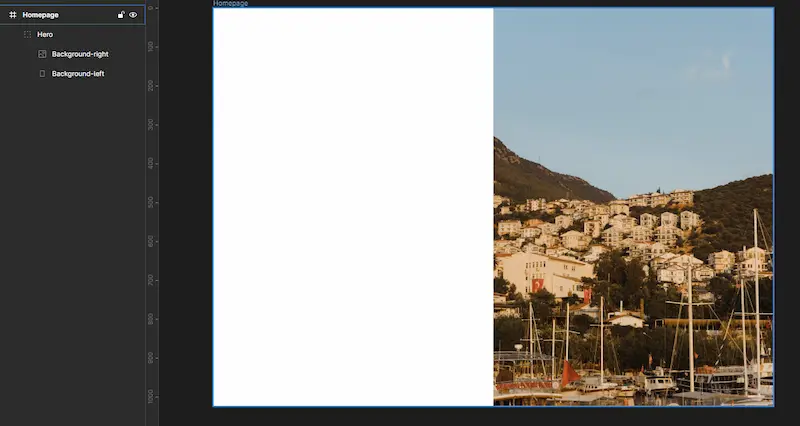
</p>

---

[◀️ Figma - Frames](./05-figma-frames.md)

[Figma - Les variables ▶️](./07-figma-variables.md)

[Retour à l'accueil 📍](../README.md)
