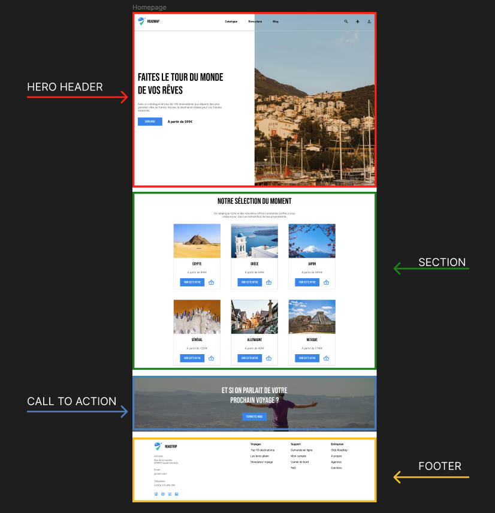
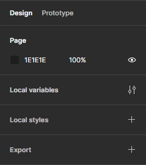
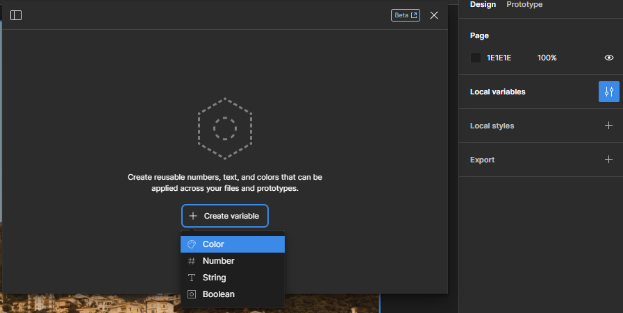
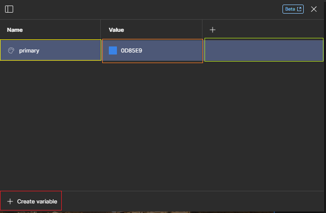
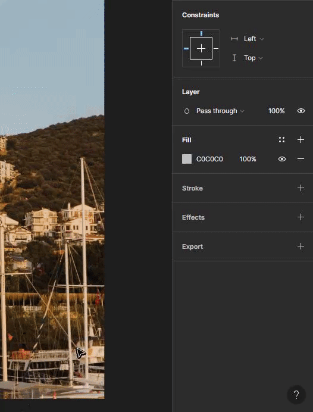
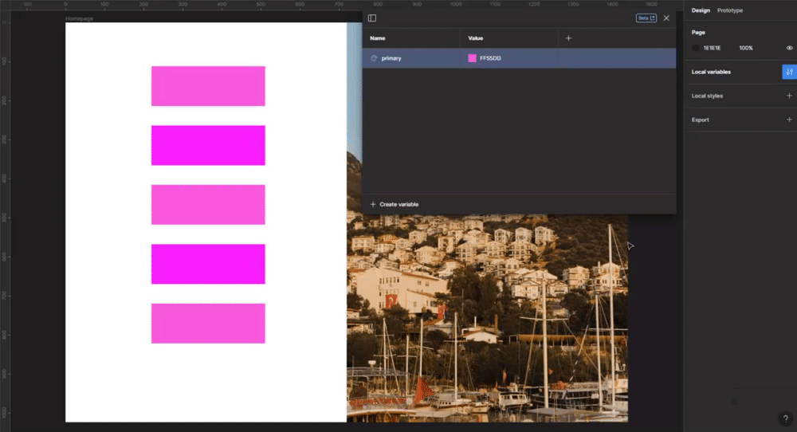

# Les variables

Désormais, on a plein de pistes pour continuer le maquettage de notre application. 🛣️ Sortons une nouvelle fois notre oeil de lynx 👁️‍🗨️ pour prendre le temps d'analyser les éléments à intégrer.

## Analyse

Voici un découpage de notre maquette par **"section"** :

    

Le but ici est de faire comme lorsque tu vas créer ta page en HTML, on décide des éléments qui vont former les grands ensembles de notre page, son squelette 🩻. Ce travail est obligatoire afin de gagner du temps et de la visibilité.

Le découpage réalisé a fait sortir 5 grands ensembles :

- **Hero header** : l'en-tête de notre page comprenant une barre de navigation. C'est un élément que l'on retrouve sur beaucoup de landing pages (la page d'accueil du site). On peut considérer que le Hero fait parti du Header en globalité. Ici, nous avons surtout recentré le contenu de ce Hero comprenant un titre, une description et un CTA (on va revenir là dessus). Le Hero a un **but de conversion** : c'est-à-dire que nos utilisateurs soient séduits à leur arrivée sur notre page afin d'aller plus loin.

- **Section** : Ensuite, on aperçoit une section composée d'un titre et de cards représentant des voyages vendu par notre entreprise.

- **CTA** : CTA ? Ça veut dire : "Call To Action", un appel à ce que notre utilisateur convertisse sa visite sur notre site à un achat, à aller plus loin dans le service proposé par le site. Ici, on en place un nouveau afin d'amener notre utilisateur à contacter l'entreprise pour parler d'un possible voyage. Attention à ne pas trop abuser des CTA, cela pourrait être oppressant pour l'utilisateur.

- **Footer** : Un pied de page comprenant les coordonnées de l'entreprise et quelques liens vers des pages utiles comme des articles pertinents, les liens utiles vers le support et le SAV ainsi que les pages de mentions légales, Conditions Générales d'Utilisation et de Vente.

Tous ces grands ensembles comprennent du texte et des formes. Surtout, on voit que certains de ces textes utilisent les mêmes polices de caractères, la même taille, la même couleur. Idem pour certaines formes. 👀

**Prenons l'exemple du bouton bleu** : Il apparaît 8 fois sur notre page. C'est un élément qui fait parti de notre charge graphique. ▶️

## Don't Repeat Yourself

Tu le sais désormais, l'un des principes même du métier de développeur est d'éviter de se répéter 🔄️❌. Cela passe notamment par le fait de déclarer des variables à un endroit précis, centralisé que l'on pourra réutiliser au besoin.

En découpant ton code de manière structurée et agile, tu peux le faire évoluer et le maintenir bien plus facilement.

En Webdesign, c'est pareil. 😉 Et dans plein d'autres domaines.

> 💡 Savais-tu que Disney a été l'un des premiers à réutiliser les mêmes plans d'animations afin de gagner du temps lors de la création de dessins animés ?

    

Revenons-en à Figma et la manière dont on va pouvoir éviter de se répéter.

## Les variables

Tu connais déjà forcément ce terme (on l'espère 🙏). Dans Figma, une variable a la même signification qu'en code : on va stocker de l'information nécessaire que l'on va pouvoir réutiliser partout.

Reprenons l'exemple du bouton : la couleur choisie est `#0D85E9`. C'est toujours la même et Figma a la spécificité de pouvoir stocker cette information afin que nous puissions la réutiliser.

### Déclarer une variable

Afin de déclarer une variable, tu vas devoir sélectionner la zone de travail (cet endroit où tu poses toutes tes frames). Clique à un endroit de cette zone (la partie sombre).

Notre panneau d'option situé à droite te donne accès à différents paramètres globaux lié à notre zone de travail et tout ce qu'elle contient.

    

Pour déclarer une variable, rends-toi sur l'onglet `Local Variables`, puis appuie sur `+ Create variable` et choisi `Color` dans le menu déroulant :

    

Désormais, une ligne a été ajoutée dans un tableau, découvrons ce qu'elle veut dire :

    

- **Name**: Comme en code, on peut donner un nom à notre variable. Ici, je l'ai appelé `primary` afin d'indiquer qu'il s'agit d'une couleur primaire de mon design.
- **Value**: Nous sommes dans un tableau associatif, celui-ci est donc composé de clés et de valeurs. `Name` est la clé, et `Value` la valeur associée. Ici, j'ai ajouté le code hexadécimal correspondant au bleu des boutons de la maquette soit `0D85E9`.
- **Options (+)**: Tu peux accéder à un menu avancé lié à la variable afin d'indiquer sa portée (l'accessibilité à une ou plusieurs pages par exemple).

### Utilisation d'une variable

Désormais, notre projet a en tête qu'une couleur nommée `primary` est disponible. Faisons l'expérience de créer une forme rectangulaire puis dans le menu d'options de notre forme dans la section `Fill`, cliquons sur le carré représentant la couleur. Le panneau de couleurs s'affichant, allons dans `Libraries` :

    

Désormais, notre forme a la couleur définie dans notre variable.

### Intérêt des variables

Comme dit précédemment, l'intérêt d'utiliser des variables est de centraliser des informations importantes et réutilisables partout. Pour voir leur intérêt sur notre design, faisons un petit jeu de rôle 🧙‍♂️ :

- Client : "_Je n'aime plus le bleu des boutons sur la maquette, je veux du `#FF00FF`_"
- Toi : "_No problemo ! Je change la variable_" (oui j'imagine que tu parles comme ça 🤷‍♂️)

Et là, devant ton client, tu retournes dans `Local variables` (accessible en cliquant sur la zone de travail) et tu changes le tout _like a boss_. 😎

    

Tu as remarqué ? Tous les éléments associés à notre variable ont instantanément changé de couleur. Faisons une démo visuelle avec des rectangles associés à une variable et des rectangles non associés :

    

Trois des formes sont liées à notre variable, cela permet de changer instantanément la valeur de la couleur associée. Le gain de temps est phénoménal. Si tu n'es toujours pas convaincu (_vraiment ?_ 😶), chronomètre-toi en changeant les couleurs forme par forme d'un côté 🦥 et changer la couleur depuis la variable associée. 🚀

> 💡 Dans les variables de Figma, tu peux stocker un nombre, du texte et même des booléens.

[Voici une vidéo de @DesignWithArash](https://youtu.be/fn4rP20U2UM?si=cJdfLh7i6d2DuyeB), un Youtubeur spécialisé sur Figma qui t'expliqueras encore énormément de choses avec les variables (dark mode, traduction d'une maquette dans différentes langues, ...). C'est très intéressant mais cela demande aussi à avoir parfois un accès "pro" (payant💲) à Figma.

---

[◀️ Figma - Formes](./06-figma-formes.md)

[Figma - Styles locaux ▶️](./08-figma-styles.md)

[Retour à l'accueil 📍](../README.md)
