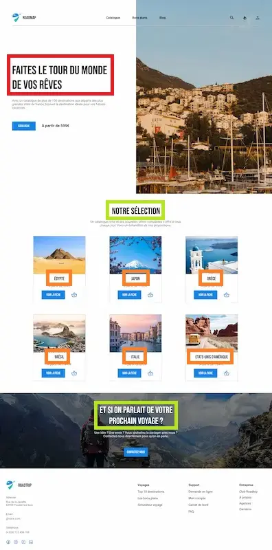
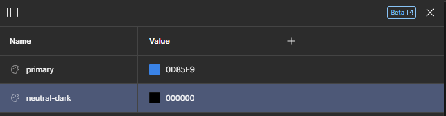
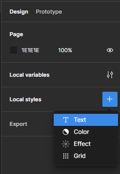
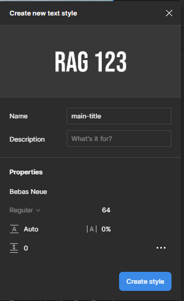
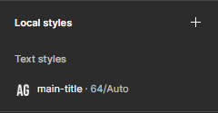
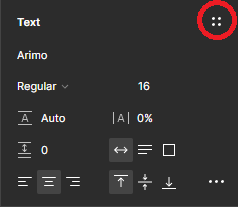
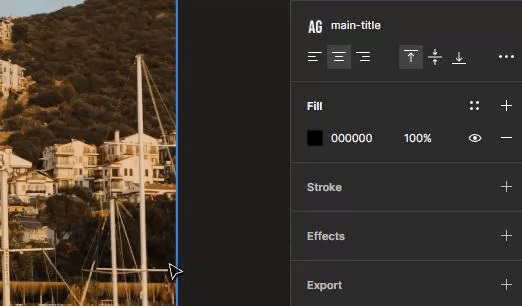
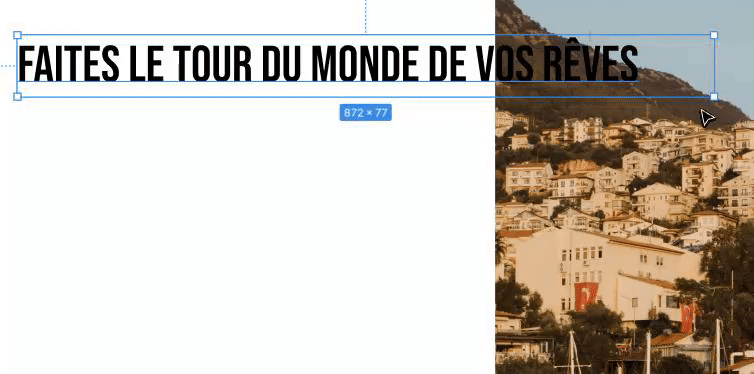

# Les styles locaux

On vient de voir que l'on peut enregistrer en mémoire des informations dans des variables que l'on peut réutiliser plus tard. Ce procédé est très pratique pour éviter de se répéter. 👌

Dans le même esprit, il existe un autre système pour enregistrer des paramètres en mémoire : **les styles locaux**. 📝

## Analyse : polices de caractères utilisées

Pour comprendre l'intérêt d'utiliser les styles prédéfinis, faisons une démonstration avec les styles de titres pour notre page.

Si l'on regarde bien, notre page contient 3 types de titres :

<p align="center">
    
</p>

- **Titre principal** : entouré en rouge 🔴, c'est le `<h1>` en HTML, le titre principal de la page sur laquelle on se situe.
- **Titre de section** : entouré en vert 🟢, ce sont les `<h2>` en HTML, les titres de section de notre page.
- **Titre de sous-section** : enfin, nous avons les titres de sous-section ou titres d'articles, les `<h3>` en HTML; ils sont ici entourés en orange 🟠.

Comme pour les variables, on voit que seul le contenu (le texte) change **mais pas leur style**. Et grâce aux `Local Styles`, nous allons pouvoir créer un style à appliquer sur nos éléments de textes pour éviter de nous répéter.

Avant de créer les styles de nos différents styles de police, faisons un tableau qui récapitule les principaux paramètres des différentes police que nous allons utiliser :

| Référence             | Police utilisée | Taille | Graisse | Couleur   |
| --------------------- | --------------- | ------ | ------- | --------- |
| Titre principal       | Bebas Neue      | 64px   | X       | `#000000` |
| Titre de section      | Bebas Neue      | 48px   | X       | `#000000` |
| Titre de sous-section | Bebas Neue      | 24px   | X       | `#000000` |
| Paragraphes           | Roboto          | 16px   | Regular | `5E5E59`  |

> 💡Le type `Paragraphes` représente le style utilisé sur le reste des textes, les blocs d'articles par exemple.

Sachant cela, nous allons déjà déclarer une nouvelle variable pour la couleur utilisée. 🤗

### À ton tour 🖌️

- Ajoute une nouvelle variable de couleur dans `Local Variables` nommée `neutral-dark` et dont la valeur est le code hexadécimal utilisé pour les titres (colonne Couleur).

- Fais la même chose avec la couleur utilisée pour les Paragraphes, ajoute une variable locale avec le code `#5E5E59` que tu nommeras `neutral-regular`.

Tu devrais avoir ces trois couleurs dans ton tableau de variables locales ⬇️ (`primary` a été déclaré dans le chapitre précédent, tu peux l'ajouter si ce n'est pas fait 😉) :

<p align="center">
    
</p>

### Création d'un style prédéfini

Désormais, nous allons déclarer un style prédéfini afin d'enregistrer le titre principal d'une catégorie. Pour ce faire :

- Clique sur ta zone de travail (hors d'une de tes frames), le menu d'options change et tu devrais pouvoir apercevoir `Local Styles`. Appuie sur le `+` et choisit l'option `Text`.

<p align="center">
    
</p>

- Un tout nouveau panneau apparaît, reprenons les éléments définis pour le titre principal et créons un style qui représentera chacun de nos titres `<h1>` (sauf la couleur) et nommons-le `main-title`:

<p align="center">
    
</p>

> ✒️ Il existe énormément d'options pour définir une police de caractères. Les caractères d'imprimerie sont modulables à l'infini. Nous resterons simples et ne parlerons pas de l'infinité de possibilités qu'il existe lorsque l'on parle de police de caractères. Toutefois, si cela vous intéresse, [Google Fonts - Knowledge](https://fonts.google.com/knowledge) contient des articles afin de plonger dans ce monde intéressant. 🤿

Ca y est, nous avons désormais accès à notre premier style prédéfini. 🥳 Il apparaît dans la colonne `Local Styles` du panneau d'options de notre zone de travail.

<p align="center">
    
</p>

### Utiliser un style prédéfini

Il est temps d'utiliser ce style prédéfini en ajoutant le titre principal situé dans notre Hero. Pour créer du texte, il te suffit d'appuyer sur l'icône `T` situé dans la barre d'outils ou tout simplement la touche `T` de ton clavier.

> `faites le tour du monde de vos rêves` < Copie cette phrase et colle-la avec l'outil de texte.

Un nouveau panneau d'options apparaît avec l'ajout d'un texte. Il y a des éléments que tu connais comme le panneau de position/dimension, le panneau de couleurs, de bordures... Mais celui qui nous intéresse ici est `Text`.

<p align="center">
    
</p>

Sur la capture d'écran, **nous t'avons entouré d'un cercle rouge un carré composé de 4 points en haut à droite** 🔴. En cliquant dessus, tu vas voir apparaître les styles définis présents. Il ne te reste qu'à choisir le style `main-title` et l'appliquer au texte que l'on vient de créer.

<p align="center">
    
</p>

Pour compléter, nous allons lui appliquer la couleur `neutral-dark`. Dans le panneau d'options, **repère la section `Fill` puis clique sur le carré composé de 4 points**, puis choisis la couleur `neutral-dark`.

<p align="center">
    
</p>

Pour parfaire le tout, nous allons (si besoin) modifier la dimension du bloc à main levée avec notre souris. Sélectionne le côté droit du bloc de texte et réduis-le pour que le texte soit sur deux lignes, comme sur la maquette.

_Si besoin, aligne le texte à gauche via l'option à cet effet dans le panneau d'options de texte._

<p align="center">
    
</p>

**Ca y est ! Notre titre principal a un style et une couleur prédéfinie. 🥳**

Si, dans un avenir plus ou moins proche, on souhaite changer les paramètres ou propriétés d'un élément de ce style, nous n'aurons pas besoin de repasser dessus directement.

On s'enlève un temps fou, on est **modulables, évolutifs, réactifs**. On est géniaux en somme ! 🤩

Et tu as remarqué ? Cela nous fait aussi une belle classe CSS que notre développeur pourra utiliser. Traduisons les paramètres pour définir notre titre principal en CSS :

```css
.main-title {
  color: "#000000";
  font-size: "64px";
  font-family: "Bebas Neue", sans-serif;
  text-align: "left";
}
```

Magique ! 🪄

---

[◀️ Figma - Les Variables](./07-figma-variables.md)

[Figma - Composants ▶️](./09-figma-composants.md)

[Retour à l'accueil 📍](../README.md)
