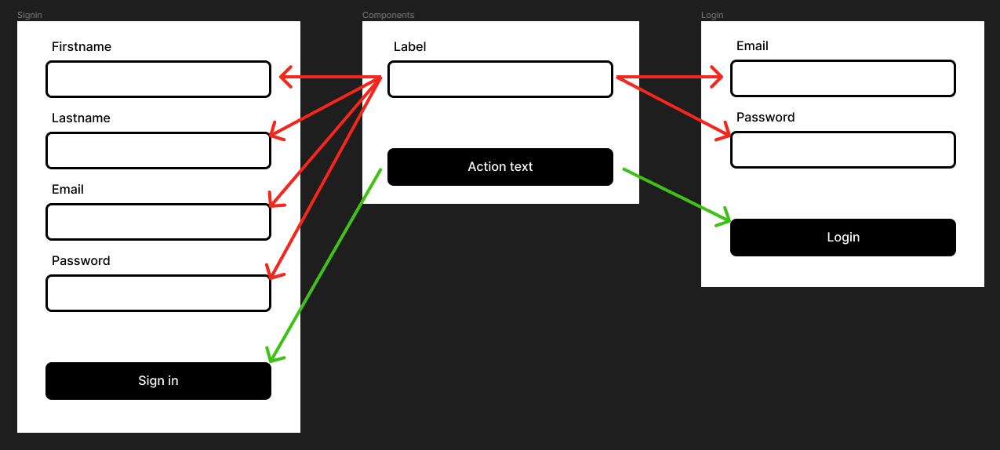
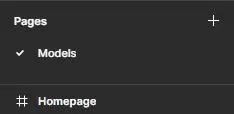
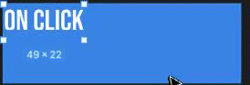
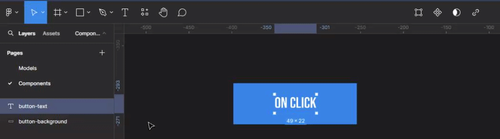
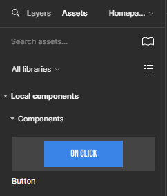
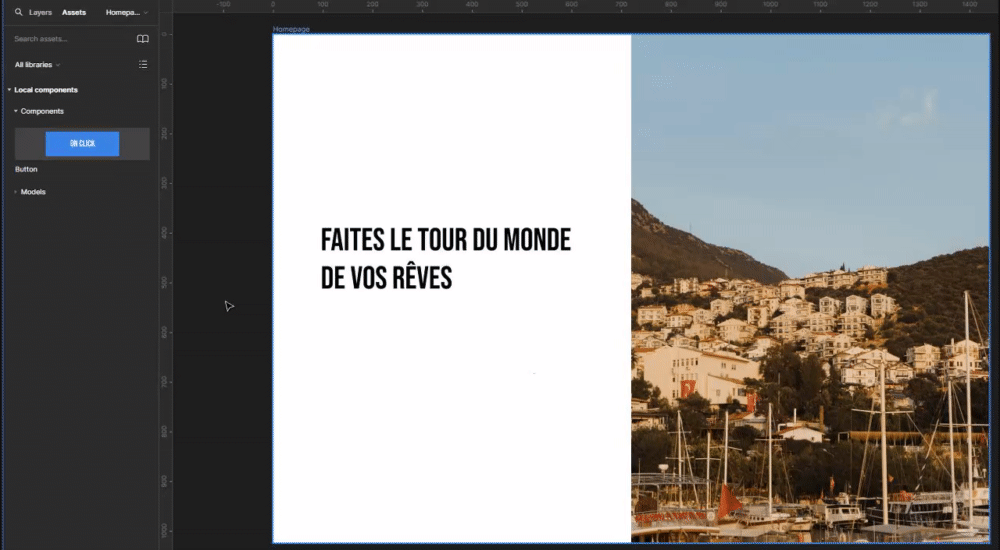
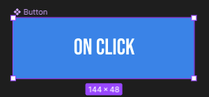
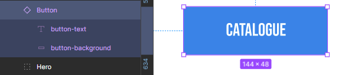

# Les composants

## Atomic design

Jusqu'ici, on a vu comment enregistrer une variable et des styles prédéfinis afin de faciliter notre travail en amont. Mais on peut encore aller plus loin 🚀.

Généralement, lorsque l'on pense à maquetter une page, on imagine réfléchir page par page; cela semble tout à fait logique et on va faire en allant, un peu de manière empirique.

Bien que logique au premier abord, un designer système du nom de Brad Frost apporte le concept d'**Atomic Design** en 2015. Celui-ci va révolutionner la manière de créer un design system, entendez par là un groupement d'éléments comme des boutons, champs de formulaires, ... du plus petit au plus grand. 🤏🙌

_Hein ? Je ... Quoi ?_ 🫠

En fait, Brad Frost propose de **créer des éléments d'UI (User Interface) indépendants** que l'on réutilisera dans toutes nos pages. Cela permettra de se focaliser sur chaque élément comme une entité propre, adaptative selon notre besoin.

**Voici un exemple de réflexion en Atomic Design ⚛️** :

1. Mon site web va permettre à des utilisateurs de s'authentifier et de se connecter. Cela veut dire potentiellement **deux pages** contenant **un formulaire**.
2. Dans ces deux pages, il va y avoir des éléments similaires :
   1. **Un champ et un label associé** pour que l'utilisateur puisse entrer des informations (email, mot de passe, etc...)
   2. **Un bouton** pour envoyer le formulaire.
3. J'ai donc **deux éléments** de design distincts **à créer** que je vais pouvoir ensuite réutiliser selon mes besoins.

    

Si j'ai besoin de réutiliser mon bouton ailleurs, dans d'autres circonstances, je le peux ! Même chose pour un champ de formulaire. 🪄 Grâce à cela :

- Je crée des éléments réutilisables au besoin. 🪄
- Je reste cohérent avec mon design. 🤩
- Je gagne du temps ! ⏱️

> 💡 Vous verrez qu'en développement web, l'Atomic Design est utilisé par différentes librairies, l'exemple le plus connu étant React.js ! ⚛️

## Composants

Désormais, nous allons utiliser le terme désigné pour ces éléments réutilisables : **composants**. Car oui, ces éléments composent nos différentes pages. Il suffit d'aller les piocher et de les inclure aux endroits nécessaires. 🍬

### Création d'un composant sur Figma

On a pile le composant idéal sur lequel travailler dont on a déjà parlé : **notre bouton bleu** 😋. Il est partout et sert à :

- **Rediriger** vers une autre page;
- **Contacter** l'équipe commerciale;
- **Ajouter un produit** dans le panier.

C'est le composant idéal sur lequel se faire la main. Pour créer un composant, on peut :

- Soit créer une frame qui contiendra tous les composants réutilisables;
- Soit créer nos composants directement sur notre zone de travail à proximité de nos frames;
- On peut même créer une page dédiée à nos composants afin de les séparer des maquettes de notre site.

Pour cette dernière option, il vous suffit de vous rendre sur le panneau de gauche et de cliquer sur le symbole `+` à droite de `Pages` :

    

Je te propose donc de créer cette nouvelle page nommée `Components`. Nous allons séparer les composants créés et notre maquette.

> Tu peux renommer la page contenant ta maquette `Models` comme sur l'exemple. 👍

Sur cette nouvelle zone de travail, nous allons créer notre bouton de cette façon :

- Crée un rectangle d'une hauteur (H) de `48px` et d'une largeur de `3 * 48px`;
- Applique-lui la couleur `primary` définie dans les variables.
- Ajoute un texte de ton choix en son centre comme par exemple : `on click`;
  - La police du texte est `Bebas Neue`;
  - La taille est de `18px`;
  - Le code hexadécimal de la couleur est `#FFFFFF`;
  - le texte doit être aligné centralement.
- Déplace le texte avec ta souris afin de le centrer verticalement et horizontalement sur notre bouton.

_Trop bien ! Figma m'a aidé à trouver la position idéale, comme si c'était aimanté !_ 🧲

    

> Tu l'as déjà peut-être remarqué en bougeant des formes sur une frame aussi ! 🧲 Figma propose des repères aimantés afin de disposer nos éléments. Et attention, il nous donne plein d'autres indications lorsque l'on déplace un élément, notamment un repère pour obtenir une marge équivalente entre différents éléments, un alignement selon des éléments déjà positionnés. Cette fonctionnalité est très intuitive et puissante. 💪

Revenons-en à notre bouton. On n'a pas totalement fini avec lui, nous allons en faire un composant. 🪄

- Comme pour un groupe, tu vas sélectionner les deux éléments (le texte et le rectangle) puis tu vas appuyer sur l'icône `Create component` (un losange composé de quatre carrés) situé dans la barre d'outils, au centre.

    

Voici les raccourcis clavier correspondant ⌨️ :
| Commande | Windows | Mac |
| --------- | -------------- | ------------- |
| Créer un composant | Ctrl + Alt + K | ⌥ + ⌘ + K |

Désormais, notre "bouton" est entouré d'une bordure violette et est renommé "Component-X" (X étant le numéro du composant créé). Tu peux le renommer "Button" afin qu'il soit correctement désigné.

### Utilisation d'un composant

Revenons sur la frame comprenant notre maquette. Pour ajouter un composant, il suffit d'aller sur le panneau de gauche, de sélectionner l'onglet `Assets`. Cet onglet va contenir tout ce qui accessible en termes de composants. Si tu déroules ensuite le menu `Local Components`, tu va voir apparaître ta page `Components` et les composants qu'elle contient (ici, notre bouton).

    

Tu n'as plus qu'à sélectionner le composant bouton et le placer sur la frame.

    

Nous venons de créer et d'ajouter **une instance** de notre composant `Button`. 🥳

> Instance ? 🤔 Tu as peut-être déjà entendu ce terme. On en parle en développement quand qu'on crée une nouvelle instance d'une classe, d'un objet. Si toutefois c'est encore flou : une instance est un nouvel objet basé sur un modèle. Dans notre cas, on a créé une nouvelle instance du composant `Button`.

Il ne manque plus qu'à changer le contenu de notre texte qui n'est pas exact. Dans notre Hero, l'instance de `Button` comporte le texte `Catalogue`. Change le texte de l'instance créée sur ta maquette puis retourne sur la zone de travail `Components` afin de voir si cela a changé le composant.

**Voici notre composant :**

    

**Voici notre instance :**

    

> On a fait un petit cercle en rouge afin de t'indiquer le symbole qui te permet de reconnaître un composant (diamant plein) et une instance (diamant vide). 🔍

Pour finir, précisons :

- **Un composant** va définir un design de base que ses instances vont appliquer. Si tu changes la couleur du bouton, toutes les instances vont prendre ce changement en compte.
- **Une instance** est définie par le composant mais reste un élément que tu peux modifier individuellement, cela n'impactera pas les autres instances ni le composant initial. C'est pour cela que tu as pu changer le texte et personnaliser le bouton à cet endroit.

---

[◀️ Figma - Les styles](./08-figma-styles.md)

[Figma - Auto layout ▶️](./10-figma-auto-layout.md)

[Retour à l'accueil 📍](../README.md)
