# Auto layout

Pour finir ce cours, on va finir par apprendre à disposer correctement nos éléments disséminés dans nos maquettes.

On parle d'auto-layout pour symboliser la manière d'automatiser la disposition de nos éléments. Propriété au sens large, l'auto-layout est une bonne base pour permettre à nos designs d'être évolutifs et de s'adapter aux différentes version que l'on souhaiterait avoir.

## Activer l'Auto-layout

Pour ajouter l'auto-layout sur un groupe d'éléments, un composant ou une frame, utilise le raccourci `Maj` + `A` ou alors l'option `Auto layout` dans le panneau de droite.

    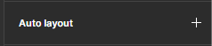

Dès à présent, de nouvelles options apparaissent sur le panneau de droite :

    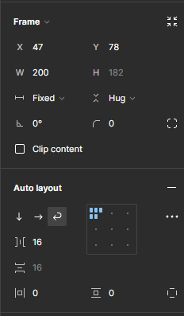

Tu as remarqué ? Non seulement, un panneau auto-layout est désormais présent mais notre panneau de gestion de l'élément obtient de nouvelles options :

    

On va reparler de ces deux champs par la suite. 🤓🔍

## Adaptation au contenu

**Un design est adaptatif, modulable**. De manière récurrente, tu vas te retrouver à vouloir voir comment ton site va s'adapter en ajoutant des éléments, en voulant voir comment celui-ci va se comporter. 🔍

Grâce à l'auto-layout, Figma permet de faire ce genre de manipulations. Prenons un exemple simple : on se crée une grille de cartes ayant un titre et une description.

    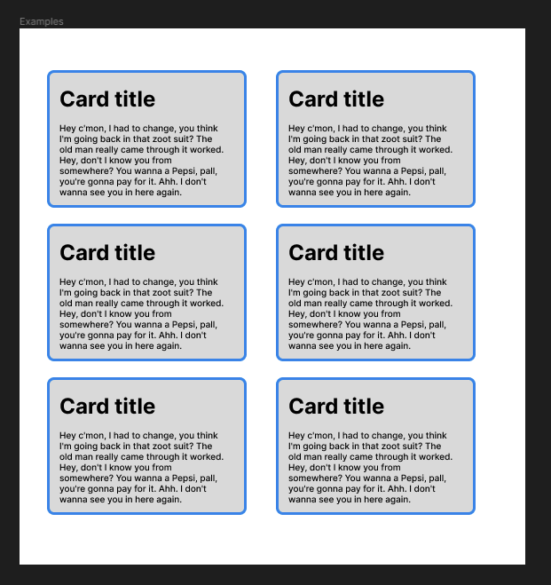

> 🤗 Tu peux, si tu le souhaites, créer une nouvelle frame temporairement et créer ces cartes. Il s'agit juste d'un rectangle qui contient un titre et du texte avec une bordure bleue puis transformé en composant dont 5 instances sont ajoutées.

Nous allons sélectionner ces trois cartes puis ajouter l'auto-layout (`Maj` + `A`). Désormais, notre panneau de gauche voit les trois éléments imbriqués dans une nouvelle 'frame'.

    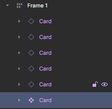

> 💡 On parle ici aussi de frame (cadre) car nos éléments vont désormais interagir entre eux, avoir leurs propres règles.

### Modifier l'espacement

Tout d'abord, travaillons sur l'espacement entre nos cards. Lorsque l'on fait une `grid` (grille) d'éléments, on souhaite toujours savoir quel sera le meilleur espacement possible sur notre maquette. Grâce à l'auto-layout, nous allons pouvoir interagir avec ces marges entre chaque élément :

    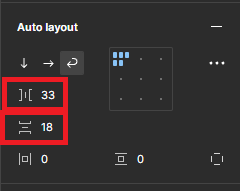

Dans l'exemple, il y a deux informations :

- **La marge horizontale entre chaque élément** de notre frame qui a pour valeur `33px`;
- **La marge verticale entre chaque élément** de notre frame qui a pour valeur `18px`.

Vous pouvez interagir directement sur ces marges par le biais de ces champs mais aussi directement sur la maquette grâce à un sélecteur disponible via votre souris :

    

Tu l'as remarqué mais si nous mettons une marge trop grande, nos éléments vont sortir du cadre. Que se passe t-il exactement à ce moment précis ? 🤔

Tout simplement, auto-layout indique à nos éléments la manière de se repositionner s'il n'y a pas assez de place dans le cadre contenant nos éléments.

### Disposition

**Auto-layout est une grille de disposition**. En CSS, tu as déjà peut-être entendu parler de `display:grid` ou `display:flex` qui sont deux propriétés permettant aux enfants directs d'un élément de se disposer d'une manière.

Par exemple, on peut alors changer la disposition initiale d'une liste à puces pour qu'elle s'étale horizontalement plutôt que verticalement.

Ici, c'est la même chose avec auto-layout et les options concernées sont celles-ci :

    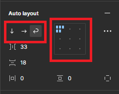

- Le premier panneau entouré (gauche) indique le sens de la disposition :

  - **Vertical layout** renverra les éléments les uns en dessous des autres;
  - **Horizontal layout** renverra les éléments les uns à côtés des autres;
  - **Wrap** est l'option qui indique que les éléments se mettront les uns à côté des autres tant qu'ils sont dans le conteneur, sinon ils iront en dessous automatiquement.

    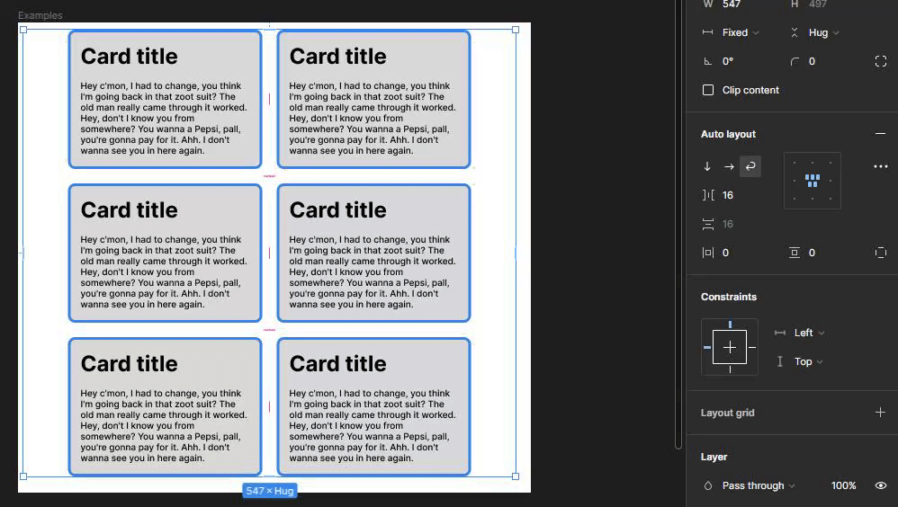

- La deuxième option entourée indique la manière dont les éléments vont être disposés dans leur conteneur. Cela peut-être en haut à gauche, en bas à droite ou au centre.

    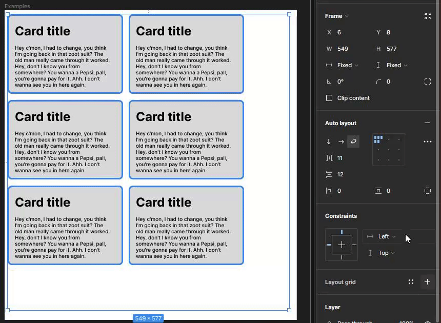

> Ca te rappelle quelque chose ? Quand tu fais du CSS et que tu appliques `display:flex`, tu as des propriétés `justify-content` et `align-items` qui permettent d'aligner le texte de cette façon. 😃

### Padding

Dernière option de notre panneau **auto-layout** est la marge intérieure :

    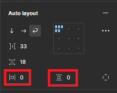

Comme en CSS, le padding est là pour indiquer quelle marge interne est nécessaire à respecter.

Tu peux très bien ajouter un padding depuis le panneau d'options à droite dans les champs entourés puis les modifier via ta souris et le curseur placé sur les contours de ton conteneur :

    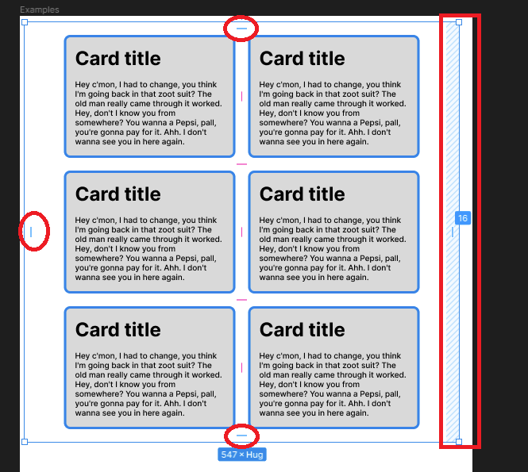

> Tu souhaites avoir un padding différent à gauche et à droite ou en haut et en bas ? Il te suffit de séparer les deux valeurs souhaitées par une virgule, exemple : `16, 32`

## Auto-layout sur un composant

L'auto-layout peut être utilisé de plein de manières différentes, c'est là toute sa puissance. Précédemment, on a vu que l'on a fait un composant puis 5 instances afin de créer une grille de cards.

Appliquons l'auto-layout sur notre composant et voyons ce que l'on peut faire avec.

En début de chapitre, on t'a parlé de deux champs qui se sont ajoutés dans la partie d'option de position et dimension de notre élément :

    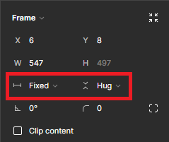

Ces deux options sont très puissantes puisqu'elles vont autoriser ou non notre élément à s'adapter à son contenu.

- Le premier champ permet de définir le comportement horizontalement.
- Le deuxième champ permet de définir le comportement verticalement.

À cela s'ajoute pour chacun de ces champs 3 options :

- **Fixed** : l'élément gardera une largeur ou une hauteur fixe, quel que soit son contenu.
- **Hug** : l'élément va s'adapter automatiquement à son contenu.
- **Fill container** (optionnel) : L'élément va s'étirer afin de coller à son parent.

Continuons avec notre composant "Card" désormais affublé de l'auto-layout dont on sait que le texte qu'elle contient peut être plus ou moins grand.

A ce stade, il faut pouvoir prévoir le cas où les informations reçues sont différentes (on ne sait pas ce qu'il y a en base de données) et il faut prévoir un comportement.

Nous allons donc adapter les propriétés de notre composant afin de lui indiquer que :

- La largeur sera `Fixed` (on ne veut pas que la carte s'élargisse);
- La hauteur sera `Hug` (on veut que la carte s'agrandisse verticalement selon le contenu).

    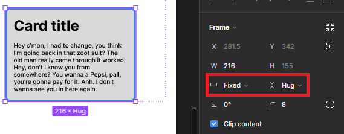

Désormais, choisissons l'une de nos instances au hasard et ajoutons-lui du texte :

    

Notre card s'adapte automatiquement à son contenu, rien ne sort, les marges internes sont respectées. C'est parfait pour adapter notre design et tester des `use cases` (des scénarios d'usages).

## En savoir plus

Tu veux en savoir plus sur l'auto-layout ? Tu as bien raison. On a vu le principal et la meilleure façon de savoir l'utiliser est de pratiquer.

Tu peux aussi te tourner la documentation de Figma concernant [auto-layout](https://help.figma.com/hc/fr/articles/360040451373-Cr%C3%A9ation-de-designs-dynamiques-avec-la-disposition-automatique) ainsi qu'un [support proposé](https://www.figma.com/community/file/784448220678228461) par les équipes de Figma.

---

[◀️ Figma - Les composants](./09-figma-composants.md)

[Figma - Maquette ▶️](./11-maquette.md)

[Retour à l'accueil 📍](../README.md)
