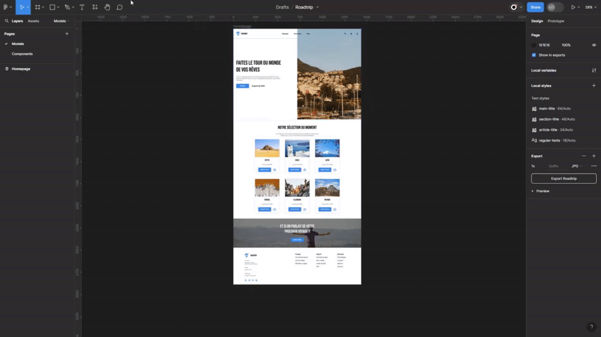

# Maquette

Il est désormais temps de réaliser cette fameuse maquette dont on t'a parlé au début. Tu as pu voir de nombreux exemples d'usages, parfois en lien avec notre maquette et parfois non, histoire de te laisser réaliser seul ce challenge. 😉😁

N'hésite pas à reprendre les chapitres pour adapter la maquette avec les fonctionnalités montrées.

Prends le temps de réfléchir posément avant d'attaquer, essaye de voir ce qui peut être un composant, un groupe d'éléments, ... 🔍

Mais surtout amuses-toi bien à réaliser cela ! 🤗😃

## Assets & styles

Pour rappel :

- Tu retrouveras toutes les icônes et images utilisées dans le dossier [exercice](../exercice/).

- Les couleurs utilisées sur la maquette sont :

  - Bleu : `#0D85E9`
  - Gris clair : `#5E5E59`
  - Gris foncé : `#C0C0C0`

- Les polices de caractères utilisées sont :
  - Titres : `Bebas Neue`
  - Texte : `Roboto`

Pour rappel, voici les principales polices de caractères à utiliser :

| Référence             | Police utilisée | Taille | Graisse | Couleur   |
| --------------------- | --------------- | ------ | ------- | --------- |
| Titre principal       | Bebas Neue      | 64px   | X       | `#000000` |
| Titre de section      | Bebas Neue      | 48px   | X       | `#000000` |
| Titre de sous-section | Bebas Neue      | 24px   | X       | `#000000` |
| Paragraphes           | Roboto          | 16px   | Regular | `5E5E59`  |

Organise-toi comme bon te semble, essaie de trouver le moyen d'être le plus efficace possible sans te répéter. 👍

## Correction

Une correction de cette maquette est disponible dans le dossier `assets/11-maquette` nommée : `atelier-figma-correction.fig`. Pour pouvoir l'utiliser :

- Clique sur le symbole `Figma` en haut à gauche de l'outil ;
- Choisis l'option `Back to files` ;
- Puis clique sur le bouton `Import` en haut à droite de l'écran de fichiers ;
- Choisis `atelier-figma-correction.fig` afin de pouvoir l'utiliser localement.

    

## Aller plus loin

Nous espérons que cette découverte de l'outil Figma et du monde du Webdesign t'as plu. 🤗 Figma est un outil vraiment puissant qui contient encore beaucoup de choses qui n'ont pas été abordées.

Si tu souhaites aller plus loin, nous te conseillons de t'intéresser au **prototypage**, une manière de rendre tes maquettes de sites utilisables afin de les montrer à ton client avant développement.

- [Guide de prototypage dans Figma](https://help.figma.com/hc/fr/articles/360040314193-Guide-de-prototypage-dans-Figma)

Tu peux aussi te balader sur la plateforme d'apprentissage [Figma Learn](https://help.figma.com/hc/fr) afin d'en apprendre plus sur cet outil. 👍

Pour finir, nous t'invitons à regarder les [ressources utiles](../ressources.md) afin de te permettre d'avoir des éléments pouvant t'aider à trouver l'inspiration pour tes designs, avoir des éléments à intégrer dans tes maquettes. 😎

---

[◀️ Figma - Auto-layout](./10-figma-auto-layout.md)

[Retour à l'accueil 📍](../README.md)
